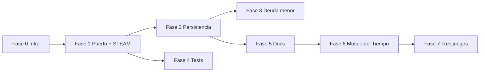

# 📝 Changelog - ExplorAventura 3

Todos los cambios notables del proyecto se documentan en este archivo.

Formato basado en [Keep a Changelog](https://keepachangelog.com/es-ES/1.0.0/).

---

## [3.2.0] - Julio 2026 — Fase 7

### 🎮 Tres minijuegos nuevos (7 → 10)

#### Añadido
- **Fábrica del Reciclaje** (`/world/fabrica-reciclaje`) — drag-and-drop a 5 contenedores, badge «Eco-Héroe Junior»
- **Taller de Ortografía** (`/world/taller-ortografia`) — quiz de huecos ortográficos, 5 corazones, badge «Maestro de la Ortografía»
- **Planetario** (`/world/planetario`) — ordenar 8 planetas por distancia al Sol, badge «Astrónomo Junior»

#### Datos e i18n
- JSON pedagógicos: `fabrica-reciclaje-items`, `taller-ortografia-items`, `planetario-bodies` (es/ca/en)
- Claves en `gameDataRegistry.ts` + hooks `useGameData` / `useReloadGameDataOnLocale`
- Traducciones UI: `reciclaje.*`, `ortografia.*`, `planetario.*`, entradas dashboard

#### Integración
- Dashboard con 10 minijuegos (iconos Recycle, SpellCheck, Orbit)
- `scripts/test-all-games-ui.mjs` ampliado a 10 juegos
- **88 tests** Jest (stores + registry; ampliado en 3.3.x)

---

## [3.2.1] - Julio 2026 — Fase 3 (deuda menor)

### ♻️ Calidad

#### Añadido
- `shared/keyboard.ts` — helpers `chainKeyboardHandler` / `handleActivationKeys`
- Tests de teclado en `shared/__tests__/keyboard.test.ts`

#### Cambiado
- Puerto Palabras y Fábrica Reciclaje: `onKeyDown` explícito en ítems arrastrables
- `package.json` raíz simplificado (scripts de conveniencia hacia `aventura-multimateria/`)

#### Documentación
- `STEAM_GAME_DOCS.md` — sección ejecución con `new Function()` y sandbox futuro
- Plan de fases 0–7 consolidado en este CHANGELOG (§ Plan de implementación)
- `README.md` raíz — aclaración del `package.json` legacy

---

## [3.3.2] - Julio 2026 — Mapamundi testeable (data-region-id)

### 🗺️ Mapamundi

#### Cambiado
- `WorldMap.tsx` / `SpainMap.tsx`: atributo `data-region-id` en zonas clicables (continente, océano, CCAA)
- `useMapamundiV2Store`: persiste `selectedRegion` en sesión
- Test UI Mapamundi: clic directo por región; eliminado fallback `map-svg`

---

## [3.3.1] - Julio 2026 — Tests UI puros + ortografía B/V G/J

### 🧪 Tests UI

#### Cambiado
- `scripts/test-all-games-ui.mjs`: victoria/derrota por interacción real en Museo, Planetario, Mapamundi y Mercado (sin fallback `localStorage`)
- Selectores drag-and-drop actualizados a `data-rfd-*` (@hello-pangea/dnd v18)
- STEAM documentado como excepción `blockly` (Blockly no automatizable de forma fiable)
- Mapamundi: `data-region-id` en zonas del mapa + victoria/derrota 100 % UI (sin fallback `map-svg`)
- Flip: botón «Ir al quiz» cuando el vídeo no carga + flujo UI sin parchear `videoWatched`

### 📚 Taller de Ortografía

#### Añadido
- 20 ítems nuevos (51–70): 10 temas B/V y 10 G/J con distractores ortográficos realistas

#### Cambiado
- Distractores genéricos (`vaca`, `beca`, `jirafa`, `gente`) sustituidos por errores pedagógicos en ítems existentes
- `gameDataRegistry.test.ts`: umbral mínimo 70 ítems

---

## [3.3.0] - Julio 2026 — Planetario v2 + CI

### 🪐 Planetario v2

#### Añadido
- Selector de modo en `/world/planetario` (como Mapamundi)
- Subrutas `/world/planetario/planetas` y `/world/planetario/exploracion`
- `PlanetGame.tsx` + `MODE_CONFIG` con sesión por modo (`hasActiveSessionForMode`)
- i18n es/ca/en para modos, selector e instrucciones por modo

### 🧪 Tests y CI

#### Cambiado
- `next.config.js`: eliminado `ignoreBuildErrors` / `ignoreDuringBuilds`
- CI usa `npm run test:ci`; umbrales Jest subidos a 62 % líneas/statements
- `page.test.tsx`: verifica los 10 enlaces «Jugar»
- Tests UI Planetario: selector + ambos modos
- Correcciones TypeScript en tests STEAM/Mapamundi y drag keyboard

---

## [Unreleased]

_Sin cambios pendientes de documentar._

---

## [3.1.2] - Julio 2026

### 🐛 Mapamundi

#### Corregido
- Partida atascada en «Cargando tareas del juego…» al entrar sin sesión (`hasActiveSession` + `playing` sin tareas)
- Botón «Reintentar» tras game over no pasaba datos localizados a `initializeGame`

### 🧪 Tests

#### Añadido
- `scripts/test-all-games-ui.mjs` — humo Playwright para los 7 minijuegos

---

## [3.1.1] - Julio 2026

### 🌐 Contenido pedagógico multilingüe

#### Añadido
- Datos de juego por locale en `src/app/data/locales/{es,ca,en}/` (7 archivos × 3 idiomas)
- `gameDataRegistry.ts` — registro estático es/ca/en
- Hook `useGameData(key)` — resuelve JSON según idioma activo
- Hook `useReloadGameDataOnLocale` — recarga pool al cambiar idioma sin partida activa
- `LanguageSwitcher` (ES / CA / EN) en el dashboard
- Persistencia de locale en `localStorage` (`exploraventura-locale`)

#### Cambiado
- Todos los minijuegos cargan contenido pedagógico desde `useGameData` (palabras, pasajes, tareas, eventos, lecciones)
- Eliminados JSON monolíticos en `src/app/data/*.json` (sustituidos por `data/locales/`)

---

## [3.1.0] - Julio 2026

### 🏛️ Museo del Tiempo — séptimo minijuego (Fase 6)

#### Añadido
- Ruta `/world/museo-tiempo` — ordenar 8 eventos históricos en línea temporal
- `museo-events.json` — 24 eventos históricos
- Store con persistencia (`museo-tiempo-storage`), 3 vidas, badge «Historiador Junior»
- Tests en `__tests__/useMuseoTiempoStore.test.ts`

### 🌐 Internacionalización

#### Añadido
- Claves i18n unificadas en `public/locales/{es,ca,en}/common.json`
- Dashboard traducido (7 juegos, títulos, materias)
- Pantallas principales de los 7 juegos traducidas (instrucciones, victoria, derrota)
- **Componentes internos** traducidos: `ReadingGame`, `MarketGame`, `PaymentChallenge`, `TimeChallenge`, `FractionChallenge`, `Quiz`, `VideoCard`, `MapGame`, `Passport`, `WorldMap`, `SpainMap`, `RobotBoard`, `BlocklyGame`
- Mensajes de feedback en stores (Mercado, STEAM, Laboratorio Flip, Mapamundi) via claves i18n
- `I18nProvider` carga desde archivos JSON (fuente única)

### 🧪 CI y cobertura

#### Añadido
- Cobertura Jest ≥ 60 % en stores y módulos compartidos
- Tests: `useGameSession`, `useMapamundiV2Store`, ampliación Bosc/Mercado/Laboratorio
- CI ejecuta `jest --coverage`

### 📊 Métricas

| Métrica | v3.0.0 | v3.1.0 |
|---------|--------|--------|
| Minijuegos | 6 | **7** |
| Tests | 46 | **65** |
| Cobertura stores | — | **63 %** líneas |

---

## [3.0.0] - Julio 2026

### 🏗️ Infraestructura compartida (Fase 0)

#### Añadido
- `src/app/world/shared/types.ts` — tipos base `GameStatus`, `BaseGameState`, `WIN_REPAIRED_TARGET`
- `src/app/world/shared/random.ts` — `shuffle` (Fisher-Yates) y `selectRandom`
- `src/app/world/shared/gameSession.ts` — `hasActiveSession`, `hasActiveSessionForMode`
- `src/app/hooks/useGameSession.ts` — hooks de montaje seguro sin resetear sesiones
- Tests compartidos en `src/app/world/shared/__tests__/shared.test.ts`
- Documentación: `docs/GAME_ARCHITECTURE.md`; plan de fases en este CHANGELOG

### 🎮 Puerto de las Palabras (Fase 1)

#### Añadido
- Persistencia con clave `puerto-palabras-storage`
- `gameStatus`, `correctWords`, pantalla de victoria con badge «Maestro del Puerto»
- Botones «Nueva partida» y «Dashboard» al completar

#### Corregido
- Victoria al alcanzar 6 aciertos (`repaired >= 6`)
- Doble conteo de XP al reasignar palabras ya correctas
- Palabras que desaparecían al soltar en el pool `"words"`
- Respuestas incorrectas ya no bloquean el reintento
- Progreso conservado entre recargas

### 🤖 Desafío STEAM (Fase 1)

#### Añadido
- `gameStatus` (`playing` | `completed` | `failed`)
- Pantalla de game over con «Reiniciar aventura»
- `resetAdventure()` para nueva partida
- Avance de nivel tras cerrar modal de éxito (`pendingAdvance`)

#### Corregido
- `gameCompleted` y badge «Ingeniero Junior» al terminar nivel 6
- Game over real cuando `lives === 0`
- Ya no avanza de nivel automáticamente sin confirmación del usuario

### 📖 Bosc de Lectura (Fase 2)

#### Añadido
- Persistencia Zustand (`bosc-lectura-storage`)
- `currentQuestionIndex` y `selectedPassages` en el store
- Tests en `__tests__/useBoscLecturaStore.test.ts`

#### Corregido
- Eliminado `localStorage` manual que solo escribía y nunca restauraba
- Navegación de preguntas flexible (ya no depende de `step % 2`)
- Pasajes aleatorios persistidos entre sesiones

### 🧮 Mercado de Números (Fase 2)

#### Añadido
- Persistencia con clave `mercado-numeros-storage`
- Flag `hasFractionAnswer` para respuestas numéricas
- `newGame()` para reiniciar con tareas nuevas
- `useGameSession` — no resetea partida en curso al recargar

#### Corregido
- Respuesta fracción con valor `0` ahora es válida

### 🗺️ Misión Mapamundi v2 (Fase 2)

#### Añadido
- Campo `xp` persistido en el store
- `gainXP()` funcional (antes solo `console.log`)

#### Corregido
- `initializeGame()` condicionado — no borra sesión al remontar
- Eliminados `console.log` de depuración en `MapGame`
- XP mostrado desde el store en pantalla de victoria

### 🧪 Laboratorio Flip (Fase 2)

#### Añadido
- Persistencia ampliada (lecciones, progreso, piezas, estado de quiz)
- `pendingQuizAction` — avance controlado desde botón «Continuar» (sin `setTimeout` huérfanos)
- Botón «Nueva partida» en pantalla de victoria

#### Corregido
- `initializeGame()` ya no se ejecuta en cada montaje
- Race conditions con auto-avance de 3 segundos eliminadas

### 🧪 Tests y calidad (Fases 3–4)

#### Añadido
- Tests STEAM: victoria, game over, `pendingAdvance`
- Tests Bosc: init, `nextQuestion`, failed
- Tests Puerto: victoria, idempotencia, reintento
- Test Mercado: fracción con valor 0

#### Corregido
- Imports no usados en `error.tsx` y `world/error.tsx`
- Warning de lockfiles duplicados: `outputFileTracingRoot` en `next.config.js`

### 📚 Documentación (Fase 5)

#### Añadido
- `docs/GAME_ARCHITECTURE.md` — contrato de arquitectura
- Plan de implementación por fases (ahora § Plan de implementación en este CHANGELOG)
- Sección «Documentación» en README con enlaces cruzados

#### Actualizado
- `README.md`, `CLAUDE.md` (raíz y subproyecto) — persistencia real por juego
- Tabla de claves localStorage alineada con implementación

### 📊 Métricas de esta versión

| Métrica | Antes (revisión jul 2026) | Después |
|---------|---------------------------|---------|
| Tests Jest | 34 | **46** |
| Juegos con victoria funcional | 4/6 | **6/6** |
| Juegos con persistencia fiable | 0–1/6 | **6/6** |
| ESLint warnings | 2 | **0** |

---

## [2.0.0] - Diciembre 2024

### 🎮 Desafío STEAM - Mejoras de Experiencia del Jugador

#### ✨ Nuevas Características
- Animaciones de movimiento paso a paso del robot
- Rastro visual del camino (trail azul)
- Estados visuales: normal, ejecutando, crash
- Feedback visual mejorado con pausas estratégicas

#### 🔧 Mejoras Técnicas
- Comunicación callback-based entre BlocklyGame y página
- Wrapper `BlocklyGame.tsx` para dynamic import
- Estado `hasCrashed` para feedback visual
- Persistencia parcial de código en localStorage

#### 🐛 Correcciones
- Botones del editor no funcionaban (comunicación rota)
- Props no pasados en wrapper de Blockly
- Logs de debug innecesarios

---

## [1.0.0] - Lanzamiento inicial

### 🎮 Juegos implementados
- Puerto de las Palabras (Gramática)
- Bosc de Lectura (Comprensión lectora)
- Mercado de Números (Matemáticas)
- Misión Mapamundi (Geografía)
- Desafío STEAM (Programación visual)
- Laboratorio Flip-Ciencia (Ciencias)

### 🏗️ Arquitectura base
- Next.js 15 con App Router
- React 18 y TypeScript
- Zustand para estado global
- Tailwind CSS
- i18n con i18next (parcial)
- Dashboard con 6 minijuegos

---

## Plan de implementación (histórico — fases 0–7)

Plan de trabajo derivado de la revisión técnica de julio 2026. Complementa [`docs/GAME_ARCHITECTURE.md`](docs/GAME_ARCHITECTURE.md) (contrato técnico). **Estado final:** ✅ fases 0–7 completadas · v3.3.2 (10 minijuegos).

### Objetivos originales

1. Cerrar el ciclo de partida en todos los juegos (victoria, derrota, badge).
2. Unificar persistencia para que el progreso sobreviva a recargas.
3. Añadir tests que cubran bugs de integración detectados.
4. Alinear documentación con el comportamiento real del código.
5. Expandir contenido (Museo del Tiempo → 10 minijuegos).

### Línea base (julio 2026)

| Verificación | Resultado inicial |
|--------------|-------------------|
| `npm ci` / `tsc` / `lint` / `build` | ✅ OK |
| Jest | 34 tests |
| Rutas HTTP | 6 juegos + dashboard |
| Victoria/derrota | ⚠️ Incompleta en Puerto Palabras y STEAM |
| Persistencia | ⚠️ Rota o inconsistente en 4+ juegos |

### Índice de fases → versiones

| Fase | Alcance | Versión |
|------|---------|---------|
| **0** | Infra compartida (`shared/`, `useGameSession`) | [3.0.0] |
| **1** | Puerto Palabras + STEAM (ciclo de juego) | [3.0.0] |
| **2** | Persistencia Bosc, Mercado, Mapamundi, Flip | [3.0.0] |
| **3** | Deuda menor (ESLint, accesibilidad, STEAM docs) | [3.2.1] |
| **4** | Tests por juego + CI con cobertura ≥ 60 % | [3.0.0], [3.1.0], [3.3.0] |
| **5** | Documentación viva (README, CLAUDE, arquitectura) | [3.0.0] |
| **6** | Museo del Tiempo + i18n unificado | [3.1.0], [3.1.1] |
| **7** | Reciclaje, Ortografía, Planetario (7 → 10 juegos) | [3.2.0] |

Posteriores mejoras fuera del plan original: Planetario v2 ([3.3.0]), tests UI puros + ortografía ([3.3.1]), Mapamundi `data-region-id` ([3.3.2]).

### Orden de ejecución

1. Fase 0 → Fase 1 (Puerto + STEAM en paralelo)
2. Fase 2 (Bosc → Mercado → Mapamundi → Laboratorio Flip)
3. Fase 4 en paralelo con Fase 2
4. Fase 5 cuando Fase 2 estable
5. Fase 6 (Museo del Tiempo)
6. Fase 7 (Reciclaje, Ortografía, Planetario)

### Fase 7 — resumen

| Juego | Materia | Patrón de código |
|-------|---------|------------------|
| Fábrica del Reciclaje | Medio ambiente | `puerto-palabras` |
| Taller de Ortografía | Lengua | `bosc-lectura` (quiz) |
| Planetario | Ciencias | `museo-tiempo` |

### Definition of Done (proyecto)

- [x] Los 10 juegos tienen victoria, derrota (si aplica) y badge funcionales
- [x] Recargar la página no pierde una partida en curso
- [x] ≥ 88 tests Jest en CI con cobertura stores ≥ 60 %
- [x] Documentación alineada con implementación (10 minijuegos)
- [x] Contenido pedagógico es/ca/en (10 archivos × 3 locales)
- [x] i18n en pantallas principales de los 10 juegos
- [x] Humo Playwright 10/10 (`npm run test:ui`)

### Trazabilidad

| Origen | Documento |
|--------|-----------|
| ~~Revisión técnica abril 2026~~ | ~~`ANALISIS_REVISION.md`~~ (eliminado) |
| Contrato de arquitectura | [`docs/GAME_ARCHITECTURE.md`](docs/GAME_ARCHITECTURE.md) |
| Historial de versiones | Este archivo |
| Detalle STEAM / Blockly | [`STEAM_GAME_DOCS.md`](STEAM_GAME_DOCS.md) |

---

## Claves localStorage por versión

| Juego | Clave | Desde |
|-------|-------|-------|
| Puerto Palabras | `puerto-palabras-storage` | 3.0.0 |
| Bosc Lectura | `bosc-lectura-storage` | 3.0.0 |
| Mercado Números | `mercado-numeros-storage` | 3.0.0 |
| Mapamundi v2 | `mapamundi-v2-session` | 1.0.0 (mejorado 3.0.0) |
| Desafío STEAM | `steam-v2-storage` | 2.0.0 (mejorado 3.0.0) |
| Laboratorio Flip | `laboratorio-flip-storage` | 3.0.0 |
| Museo del Tiempo | `museo-tiempo-storage` | 3.1.0 |

---

*Mantenido junto con `docs/GAME_ARCHITECTURE.md`.*
