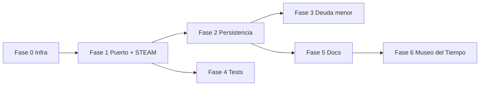

# Plan de corrección, documentación y expansión — ExplorAventura 3

Plan de trabajo derivado de la revisión técnica de julio 2026. Complementa [GAME_ARCHITECTURE.md](./GAME_ARCHITECTURE.md), que define el **contrato objetivo**; este documento define el **orden y alcance de implementación**.

**Estado:** ✅ Fases 0–6 implementadas · 📋 Fase 7 planificada (v3.2.0)  
**Alcance actual:** 10 juegos (Fase 7 completada v3.2.0)

---

## Objetivos

1. Cerrar el ciclo de partida en todos los juegos (victoria, derrota, badge).
2. Unificar persistencia para que el progreso sobreviva a recargas.
3. Añadir tests que cubran bugs de integración detectados.
4. Alinear documentación con el comportamiento real del código.
5. (Opcional) Diseñar e implementar un séptimo minijuego.

---

## Resumen de la revisión (baseline)

| Verificación | Resultado |
|--------------|-----------|
| `npm ci` / `tsc` / `lint` / `build` | ✅ OK |
| Jest (34 tests) | ✅ OK |
| Rutas HTTP (6 juegos + dashboard) | ✅ 200 |
| Lógica de victoria/derrota | ⚠️ Incompleta en Puerto Palabras y STEAM |
| Persistencia entre sesiones | ⚠️ Rota o inconsistente en 4+ juegos |

---

## Fase 0 — Infraestructura compartida

**Prerrequisito** antes de parchear juego por juego.

### Entregables

| Archivo | Responsabilidad |
|---------|-----------------|
| `src/app/world/shared/types.ts` | `GameStatus`, `BaseGameState`, `GameFeedback`, `BaseGameActions` |
| `src/app/world/shared/random.ts` | `shuffle`, `selectRandom` (Fisher-Yates) |
| `src/app/world/shared/gameSession.ts` | `hasActiveSession(state)` |
| `src/app/hooks/useGameSession.ts` | Hook: init solo si no hay sesión activa |

### Criterios

- [x] Tipos exportados y usables desde cualquier store
- [x] Tests unitarios de `shuffle` y `hasActiveSession`
- [x] Documentado en GAME_ARCHITECTURE.md §13

### Patrón de montaje (objetivo)

```typescript
useEffect(() => {
  if (!hasActiveSession(useMyGameStore.getState())) {
    initializeGame();
  }
}, []);
```

Botón explícito **«Nueva partida»** en victoria/derrota/instrucciones → sí llama a `initializeGame()`.

---

## Fase 1 — Correcciones críticas (ciclo de juego incompleto)

### 1.1 Puerto de las Palabras — Prioridad ALTA

| Bug | Solución | Archivos |
|-----|----------|----------|
| Sin victoria en `repaired >= 6` | Añadir `gameStatus`, `completedWords`; comprobar victoria en `assignWord` | `usePuertoPalabrasStore.ts`, `page.tsx` |
| Doble conteo al reasignar | Solo sumar XP/`repaired` si la palabra no estaba ya correcta | `usePuertoPalabrasStore.ts` |
| Palabra desaparece al soltar en pool `"words"` | Ignorar drop o tratar como desasignar sin ocultar | `page.tsx` |
| Error bloquea reintento | Respuesta incorrecta no bloquea reintento definitivo | `usePuertoPalabrasStore.ts` |
| Reset al recargar | `persist` + `useGameSession` | store, `page.tsx` |

**UI:** pantalla de victoria (XP, badge «Maestro del Puerto», Nueva partida, Dashboard).

**Tests:** victoria al 6.º acierto; reasignar no duplica XP; drop incorrecto permite reintento.

---

### 1.2 Desafío STEAM — Prioridad ALTA

| Bug | Solución | Archivos |
|-----|----------|----------|
| `gameCompleted` nunca se activa | Último nivel → `gameCompleted: true`, `badge: true` | `useSteamStore.ts` |
| Sin game over | `lives === 0` → pantalla `failed` | `useSteamStore.ts`, `page.tsx` |
| `nextTask()` inmediato tras éxito | Avanzar tras cerrar modal / botón «Siguiente nivel» | store, `page.tsx` |
| 0 vidas al volver | Botón «Reiniciar aventura» | `page.tsx` |

**Tests:** nivel 6 completado → `gameCompleted`; 3 vidas perdidas → `failed`.

---

## Fase 2 — Persistencia y estado (4 juegos)

### 2.1 Bosc de Lectura

- Migrar de `localStorage` manual a `zustand/persist` (`bosc-lectura-storage`)
- Mover `selectedPassages` al store
- Sustituir `step % 2` por índice respecto a `passage.questions.length`

**Archivos:** `useBoscLecturaStore.ts`, `ReadingGame.tsx`

---

### 2.2 Mercado de Números

- `loadTasks()` condicionado con `useGameSession`
- Fracciones: distinguir «sin respuesta» de `0` (`undefined` o `hasAnswer`)

**Archivos:** `useMercadoNumerosStore.ts`, `FractionChallenge.tsx`, `page.tsx`

---

### 2.3 Misión Mapamundi v2

- No llamar `initializeGame()` en montaje si hay sesión activa
- Implementar `gainXP()` real en el store
- Centralizar validación en `submitAnswer()`; quitar `console.log`

**Archivos:** `useMapamundiV2Store.ts`, `MapGame.tsx`

---

### 2.4 Laboratorio Flip

- `initializeGame()` condicionado en montaje
- Cancelar `setTimeout` en unmount/reset
- Unificar auto-avance vs botón «Continuar»
- Resetear `videoWatched` al cambiar vídeo alternativo

**Archivos:** `useLaboratorioFlipStore.ts`, `page.tsx`, `Quiz.tsx`, `VideoCard.tsx`

---

## Fase 3 — Calidad y deuda menor

| Área | Tarea |
|------|-------|
| ESLint | Quitar `CardFooter` no usado en `error.tsx` |
| Next.js | `outputFileTracingRoot` en `next.config.js` (warning lockfiles) |
| Repo raíz | Documentar/eliminar `package.json` duplicado en `/workspace` |
| Accesibilidad | `onKeyDown` donde hay `tabIndex={0}` |
| Shuffle | Fisher-Yates en todos los stores (vía `shared/random.ts`) |
| STEAM | Documentar uso de `new Function()`; valorar sandbox futuro |

---

## Fase 4 — Tests y CI

### Cobertura objetivo por juego

| Juego | Tests actuales | Añadir |
|-------|----------------|--------|
| Puerto Palabras | Store básico | Victoria, reintento, persistencia |
| Bosc Lectura | — | Store + preguntas variables |
| Mercado Números | Store completo | Persistencia, fracción 0 |
| Mapamundi v2 | — | `gainXP`, no-reset con sesión |
| STEAM | — | `gameCompleted`, game over |
| Laboratorio Flip | Store básico | Timeout, no-reset |
| Dashboard | 2 tests | Enlaces a 6 juegos |

### CI

Ampliar `.github/workflows/ci.yml`:

```yaml
- name: Tests with coverage
  run: npx jest --ci --coverage --coverageThreshold='{"global":{"lines":60}}'
```

Umbral inicial 60 %; subir progresivamente.

---

## Fase 5 — Actualización de documentación

| Archivo | Acción |
|---------|--------|
| `docs/GAME_ARCHITECTURE.md` | ✅ Creado — contrato y arquitectura |
| `docs/CORRECTION_PLAN.md` | ✅ Este documento |
| `README.md` | Actualizar tras cada fase (tabla estado juegos) |
| `CLAUDE.md` (raíz y subproyecto) | Sincronizar persistencia y patrones |
| `ANALISIS_REVISION.md` | ~~Eliminado~~ — sustituido por este plan y GAME_ARCHITECTURE |
| `CHANGELOG.md` | Entrada por fase completada |
| `STEAM_GAME_DOCS.md` | Flujo victoria/game over |

---

## Fase 6 — Séptimo juego e i18n ✅

### Museo del Tiempo (Historia) — implementado

| Aspecto | Detalle |
|---------|---------|
| Ruta | `/world/museo-tiempo` |
| Mecánica | Ordenar eventos en línea temporal (drag-and-drop) |
| Datos | `museo-events.json` (24 eventos) |
| Victoria | 8 eventos ordenados, 3 vidas |
| Persistencia | `museo-tiempo-storage` |

### i18n unificado — implementado

- Claves en `public/locales/{es,ca,en}/common.json`
- Dashboard + 7 juegos con pantallas de instrucciones/victoria/derrota traducidas
- `I18nProvider` carga desde JSON (fuente única)

### CI cobertura ≥ 60 % — implementado

- `jest.config.js` acotado a stores + shared
- 64+ tests; umbral 60 % en CI

---

## Orden de ejecución



**Secuencia recomendada:**

1. Fase 0
2. Fase 1 (Puerto Palabras + STEAM en paralelo)
3. Fase 2 (Bosc → Mercado → Mapamundi → Laboratorio Flip)
4. Fase 4 en paralelo con Fase 2
5. Fase 5 cuando Fase 2 esté estable
6. Fase 6 solo si se quiere expandir contenido
7. **Fase 7** — tres minijuegos (Reciclaje, Ortografía, Planetario) → ver [PHASE7_NEW_GAMES_PLAN.md](./PHASE7_NEW_GAMES_PLAN.md)

---

## Fase 7 — Tres minijuegos nuevos (v3.2.0) 📋

**Plan detallado:** [PHASE7_NEW_GAMES_PLAN.md](./PHASE7_NEW_GAMES_PLAN.md)

| Juego | Materia | Referencia de código |
|-------|---------|---------------------|
| Fábrica del Reciclaje | Medio ambiente | `puerto-palabras` |
| Taller de Ortografía | Lengua | `bosc-lectura` (quiz) |
| Planetario | Ciencias | `museo-tiempo` |

### Entregables Fase 7

- [ ] 3 rutas `/world/*` con store, tests e i18n es/ca/en
- [ ] Dashboard con 10 minijuegos
- [ ] `gameDataRegistry` ampliado (3 claves)
- [ ] Limpieza legacy (§7 del plan Fase 7)
- [ ] `CHANGELOG [3.2.0]`

---

## Criterios de «hecho» (Definition of Done)

- [x] Los 7 juegos tienen victoria, derrota y badge funcionales
- [x] Recargar la página no pierde una partida en curso
- [x] ≥ 64 tests pasando en CI con cobertura ≥ 60 %
- [x] Documentación alineada con implementación
- [x] Séptimo juego con ≥ 15 ítems de contenido (24 eventos)
- [x] i18n en pantallas principales de los 7 juegos (es/ca/en)

---

## Trazabilidad

| Origen | Documento |
|--------|-----------|
| ~~Revisión técnica abril 2026~~ | ~~`ANALISIS_REVISION.md`~~ (eliminado — obsoleto) |
| Contrato de arquitectura | [GAME_ARCHITECTURE.md](./GAME_ARCHITECTURE.md) |
| Plan Fase 7 (v3.2.0) | [PHASE7_NEW_GAMES_PLAN.md](./PHASE7_NEW_GAMES_PLAN.md) |
| Plan de implementación | Este archivo |
| PR documentación arquitectura | [#4](https://github.com/Mindbreaker81/mini_aventura3/pull/4) |

---

*Última actualización: julio 2026*
