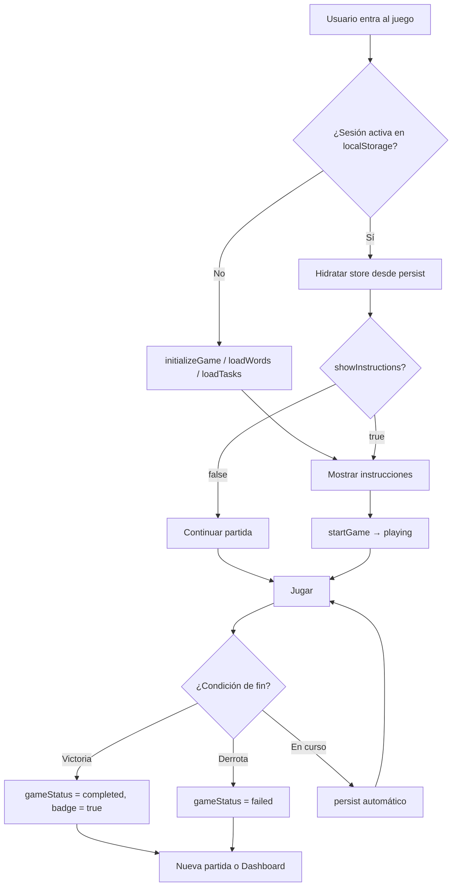

# Arquitectura de minijuegos — ExplorAventura 3

Documento de referencia para desarrolladores. Define el patrón estándar de los minijuegos, el contrato de stores Zustand, la persistencia de sesión y el checklist para añadir juegos nuevos.

**Versión:** 1.0  
**Ámbito:** `aventura-multimateria/`  
**Audiencia:** 8–9 años (primaria), entorno ES/CA/EN

---

## 1. Visión general

ExplorAventura 3 es una aplicación Next.js 15 (App Router) con **7 minijuegos** (objetivo **10** tras Fase 7). Cada juego sigue la misma estructura conceptual:

```
Datos (JSON) → Store (Zustand) → Página (page.tsx) → Componentes de juego
```

Los juegos **no comparten estado entre sí**. Solo comparten:

- Hook de navegación (`useNavigation`)
- Componentes UI (`src/components/ui/`)
- Estilos globales (`globals.css`, Tailwind)
- Convenciones de XP, badges y pantallas de instrucciones/victoria/derrota

### Mapa de juegos actuales

| Código | Ruta | Materia | Store |
|--------|------|---------|-------|
| `puerto-palabras` | `/world/puerto-palabras` | Gramática | `usePuertoPalabrasStore` |
| `bosc-lectura` | `/world/bosc-lectura` | Lectura comprensiva | `useBoscLecturaStore` |
| `mercado-numeros` | `/world/mercado-numeros` | Matemáticas aplicadas | `useMercadoNumerosStore` |
| `mision-mapamundi-v2` | `/world/mision-mapamundi-v2` | Geografía | `useMapamundiV2Store` |
| `desafio-steam` | `/world/desafio-steam` | Programación visual | `useSteamStore` |
| `laboratorio-flip` | `/world/laboratorio-flip` | Ciencias | `useLaboratorioFlipStore` |
| `museo-tiempo` | `/world/museo-tiempo` | Historia | `useMuseoTiempoStore` |

### Mapa planificado (Fase 7 — v3.2.0)

| Código | Ruta | Materia | Store (planificado) |
|--------|------|---------|---------------------|
| `fabrica-reciclaje` | `/world/fabrica-reciclaje` | Medio ambiente | `useFabricaReciclajeStore` |
| `taller-ortografia` | `/world/taller-ortografia` | Lengua / ortografía | `useTallerOrtografiaStore` |
| `planetario` | `/world/planetario` | Ciencias (Sistema Solar) | `usePlanetarioStore` |

Detalle de implementación: [PHASE7_NEW_GAMES_PLAN.md](./PHASE7_NEW_GAMES_PLAN.md).

Mapamundi tiene subrutas dinámicas: `/world/mision-mapamundi-v2/[mode]` con `mode ∈ { continent, ocean, ccaa }`.

---

## 2. Stack y dependencias por tipo de juego

| Capa | Tecnología |
|------|------------|
| Framework | Next.js 15, React 18, TypeScript |
| Estado | Zustand 5 + middleware `persist` (donde aplique) |
| Estilos | Tailwind CSS 3, componentes shadcn/ui |
| i18n | i18next + react-i18next vía `I18nProvider` |
| Drag & drop | `@hello-pangea/dnd` (Puerto Palabras) |
| Mapas | react-simple-maps + topojson (Mapamundi) |
| Programación visual | Blockly 12 (STEAM, solo cliente) |
| Vídeo | react-player (Laboratorio Flip, import dinámico) |

**Regla SSR:** librerías que acceden al DOM (Blockly, react-player, mapas) deben cargarse con `dynamic(..., { ssr: false })` o en archivos `*.client.tsx`.

---

## 3. Estructura de carpetas

### 3.1 Layout del monorepo

```
/workspace/
├── aventura-multimateria/     ← Proyecto activo (npm ci / dev / build aquí)
│   ├── docs/
│   │   └── GAME_ARCHITECTURE.md
│   ├── src/app/
│   │   ├── data/              ← JSON de contenido
│   │   ├── hooks/
│   │   ├── world/             ← Un directorio por minijuego
│   │   ├── components/
│   │   ├── page.tsx           ← Dashboard
│   │   └── layout.tsx
│   └── public/locales/        ← es, ca, en
└── package.json               ← Legacy; no usar para build
```

### 3.2 Plantilla de un minijuego

```
src/app/world/<codigo-juego>/
├── types.ts                   # Interfaces TypeScript del dominio
├── use<Nombre>Store.ts        # Store Zustand (+ persist)
├── page.tsx                   # Pantallas: instrucciones | juego | victoria | derrota
├── <ComponenteJuego>.tsx      # UI principal (puede haber varios)
├── *.client.tsx               # Solo cliente (si aplica)
├── *-utils.ts                 # Lógica pura extraíble (tests fáciles)
└── __tests__/
    └── use<Nombre>Store.test.ts
```

Datos en paralelo:

```
src/app/data/locales/<locale>/<codigo-juego>.json
```

---

## 4. Contrato del store (estándar objetivo)

Todo minijuego **debe** converger hacia este contrato. Hoy algunos juegos lo cumplen parcialmente; la columna «Objetivo» indica el estado deseado tras la refactorización planificada.

### 4.1 Tipos base compartidos (a crear en `src/app/world/shared/types.ts`)

```typescript
/** Estados de partida unificados */
export type GameStatus =
  | 'instructions'
  | 'playing'
  | 'completed'
  | 'failed';

/** Feedback modal genérico */
export interface GameFeedback {
  show: boolean;
  correct: boolean;
  message: string;
  explanation?: string;
}

/** Campos mínimos que todo store de juego debe exponer */
export interface BaseGameState {
  xp: number;
  badge: boolean;
  gameStatus: GameStatus;
  showInstructions: boolean;
  feedback: GameFeedback | null;
}

/** Acciones mínimas comunes */
export interface BaseGameActions {
  startGame: () => void;
  showFeedback: (correct: boolean, message: string, explanation?: string) => void;
  hideFeedback: () => void;
  resetGame: () => void;
}
```

### 4.2 Campos obligatorios por responsabilidad

| Responsabilidad | Campo / acción | Descripción |
|-----------------|----------------|-------------|
| Progreso | `gameStatus` | Controla qué pantalla renderiza `page.tsx` |
| Recompensa | `xp`, `badge` | XP acumulado; badge al completar con éxito |
| UX inicial | `showInstructions` | Pantalla de bienvenida antes de jugar |
| Feedback | `feedback` + `hideFeedback` | Modal/toast tras cada acción del jugador |
| Ciclo de vida | `initializeGame()` | Carga datos aleatorios y resetea partida **nueva** |
| Ciclo de vida | `resetGame()` | Vuelve al estado inicial (botón «Reintentar») |
| Fin de partida | lógica en store | Transición a `completed` o `failed` **dentro del store**, no solo en UI |

### 4.3 Reglas de diseño del store

1. **La lógica de victoria/derrota vive en el store**, no dispersa en componentes.
2. **`initializeGame()` solo se invoca** si no hay sesión activa (ver §5) o si el usuario pulsa «Nueva partida».
3. **No usar `console.log` como lógica de juego** (p. ej. «Juego completado» en STEAM).
4. **Mezcla aleatoria:** usar Fisher-Yates, no `.sort(() => Math.random() - 0.5)`.
5. **Respuestas numéricas:** distinguir «sin respuesta» de `0` (usar `undefined` o flag `hasAnswer`).
6. **Idempotencia:** una misma acción correcta no debe sumar XP dos veces (Puerto Palabras).

---

## 5. Persistencia y sesión

### 5.1 Flujo objetivo



### 5.2 Definición de «sesión activa»

Una sesión se considera **activa** si se cumple **al menos una** de:

```typescript
function hasActiveSession(state: { gameStatus: GameStatus; /* progreso parcial */ }): boolean {
  if (state.gameStatus === 'playing') return true;
  if (state.gameStatus === 'completed' || state.gameStatus === 'failed') return true;
  // Ejemplos de progreso parcial (según juego):
  // repaired > 0, currentTask > 0, completedStamps > 0, etc.
  return false;
}
```

**Anti-patrón actual (a corregir):**

```typescript
// ❌ Resetea siempre al montar — borra sesión persistida
useEffect(() => {
  initializeGame();
}, [initializeGame]);
```

**Patrón correcto (a implementar en `useGameSession`):**

```typescript
// ✅ Solo inicializa partida nueva si no hay sesión
useEffect(() => {
  if (!hasActiveSession(useMyGameStore.getState())) {
    initializeGame();
  }
}, []);
```

### 5.3 Claves de localStorage

| Juego | Clave | Middleware persist | Estado actual | Objetivo |
|-------|-------|-------------------|---------------|----------|
| Puerto Palabras | — | No | Reset en cada visita | `puerto-palabras-storage` |
| Bosc Lectura | `bosc-session` | Manual (solo escribe) | No restaura | `bosc-lectura-storage` vía persist |
| Mercado Números | — | No | Reset en cada visita | `mercado-numeros-storage` |
| Mapamundi v2 | `mapamundi-v2-session` | Sí | Conflicto con `initializeGame()` en montaje | Persist sin reset |
| Desafío STEAM | `steam-v2-storage` | Sí (parcial) | `gameCompleted` no persistido ni activado | Completar ciclo + persist |
| Laboratorio Flip | `laboratorio-flip-storage` | Sí (parcial) | `initializeGame()` borra progreso | Persist sin reset |

### 5.4 Configuración recomendada de `persist`

```typescript
persist(
  (set, get) => ({ /* state + actions */ }),
  {
    name: '<codigo-juego>-storage',
    partialize: (state) => ({
      // Persistir TODO lo necesario para reanudar:
      gameStatus: state.gameStatus,
      xp: state.xp,
      badge: state.badge,
      // + campos de progreso (currentTask, roundWords, tasks, etc.)
      // NO persistir: feedback transitorio, flags de animación, isExecuting
    }),
  }
)
```

**Persistir siempre:** `gameStatus`, progreso (índices, colecciones seleccionadas), `xp`, `badge`, datos de ronda (`tasks`, `lessons`, `roundWords`).

**No persistir:** `feedback`, `isExecuting`, `showFeedback`, estados de animación efímeros.

---

## 6. Ciclo de vida de la UI (`page.tsx`)

Toda página de juego sigue este árbol de renderizado:

```
page.tsx
├── showInstructions === true  →  Pantalla de bienvenida + botón «Empezar»
├── gameStatus === 'completed' →  Pantalla de victoria (XP, badge, «Nueva partida», Dashboard)
├── gameStatus === 'failed'    →  Pantalla de derrota («Reintentar», Dashboard)
└── gameStatus === 'playing'   →  <ComponenteJuego /> + header (XP, vidas, progreso)
```

### 6.1 Elementos comunes del header

- Botón **Dashboard** → `useNavigation().goToDashboard()` (preferir `router.push('/')` sobre `window.location`)
- Contador de **XP**
- Indicador de **vidas/corazones** (si aplica)
- Barra de **progreso** (`Progress` de shadcn/ui)

### 6.2 Pantallas de fin de partida

Deben incluir:

| Elemento | Descripción |
|----------|-------------|
| Mensaje principal | Celebración o ánimo para reintentar |
| XP total | Valor del store |
| Badge | Solo si `badge === true` |
| «Nueva partida» | Llama a `initializeGame()` o `resetGame()` + init |
| «Dashboard» | `goToDashboard()` |

**Referencia de implementación:** `mercado-numeros/page.tsx` (victoria/derrota bien definidas).

---

## 7. Capa de datos (JSON)

Los archivos viven en `src/app/data/locales/{es,ca,en}/`:

| Archivo | Juego | Contenido |
|---------|-------|-----------|
| `puerto-words.json` | Puerto Palabras | `{ word, category, rule }[]` |
| `bosc-passages.json` | Bosc Lectura | Pasajes con `questions[]` |
| `mercado-tasks.json` | Mercado Números | Tareas `PAGO` \| `HORA` \| `FRACCION` |
| `mapamundi-tasks.json` | Mapamundi | `{ mode, id, name, ... }[]` |
| `steam-tasks.json` | STEAM | Niveles con tablero, muros, meta |
| `flip-lessons.json` | Laboratorio Flip | Lecciones con vídeos y quiz |
| `museo-events.json` | Museo del Tiempo | Eventos históricos con año |
| `fabrica-reciclaje-items.json` | Fábrica Reciclaje *(Fase 7)* | `{ item, bin, rule }[]` |
| `taller-ortografia-items.json` | Taller Ortografía *(Fase 7)* | `{ sentence, options, answer, rule }[]` |
| `planetario-bodies.json` | Planetario *(Fase 7)* | `{ id, name, order, fact }[]` |

Acceso en runtime:

```typescript
import { useGameData } from '@/app/hooks/useGameData';

const words = useGameData('puerto-words'); // según i18n.language
```

Registro estático: `src/app/data/gameDataRegistry.ts`.

### 7.1 Convenciones de datos

- **IDs estables** en cada ítem (número o string).
- **Discriminadores de tipo** para uniones (`type: "PAGO"`).
- **Explicaciones pedagógicas** en campo `explanation` o `rule`.
- **Cantidad suficiente** para selección aleatoria (típico: 8 tareas, 10 palabras, 4 lecciones por partida).
- Validar en tests que el JSON cumple el tipo TypeScript correspondiente.

### 7.2 Selección aleatoria estándar

```typescript
function shuffle<T>(array: T[]): T[] {
  const result = [...array];
  for (let i = result.length - 1; i > 0; i--) {
    const j = Math.floor(Math.random() * (i + 1));
    [result[i], result[j]] = [result[j], result[i]];
  }
  return result;
}

function selectRandom<T>(items: T[], count: number): T[] {
  return shuffle(items).slice(0, count);
}
```

Ubicación recomendada: `src/app/world/shared/random.ts`.

---

## 8. Sistema de recompensas

### 8.1 XP (valores orientativos actuales)

| Juego | Acierto | Bonus final |
|-------|---------|-------------|
| Puerto Palabras | +10 / palabra | — (pendiente definir) |
| Bosc Lectura | +10 / pregunta | +60 al completar |
| Mercado Números | +15 / tarea | +80 al completar |
| Mapamundi v2 | Calculado en UI | Según modo |
| STEAM | +100 / nivel | — (pendiente) |
| Laboratorio Flip | +8 / acierto quiz | +60 al completar 4 lecciones |

### 8.2 Badges

- Tipo preferido: `badge: boolean` en store (Mercado, Bosc, Flip).
- STEAM usa `badge: { name: string } | null` — unificar a `boolean` + constante en `types.ts`.
- Otorgar badge en la **misma acción** que pone `gameStatus = 'completed'`, típicamente solo si quedan vidas/energía.

---

## 9. Internacionalización

Archivos: `public/locales/{es,ca,en}/common.json`.

**Estado actual:** solo Bosc de Lectura consume traducciones de forma consistente. El resto tiene textos hardcodeados en español/catalán en componentes.

### 9.1 Convención de claves

```
<codigo-juego>.<contexto>.<clave>

Ejemplos:
bosc.completed
mercado-numeros.instructions.title
puerto-palabras.feedback.correct
```

### 9.2 Checklist i18n para juegos nuevos

- [ ] Claves en `es`, `ca` y `en`
- [ ] Usar `useTranslation('common')` en componentes
- [ ] No hardcodear `lang="en"` en HTML (Bosc tenía este bug)

---

## 10. Navegación

```typescript
// src/app/hooks/useNavigation.ts
const { goToDashboard, goToGame } = useNavigation();
```

- **Dashboard → juego:** `<Link href="/world/...">` en `page.tsx` raíz.
- **Juego → dashboard:** siempre `goToDashboard()` (fallback a `window.location` si falla el router).

---

## 11. Testing

### 11.1 Ubicación

```
src/app/world/<juego>/__tests__/use<Nombre>Store.test.ts
src/app/page.test.tsx   ← Dashboard
```

### 11.2 Qué debe probar cada suite de store

| Caso | Obligatorio |
|------|-------------|
| Estado inicial tras `initializeGame` | ✅ |
| Acierto incrementa XP / progreso | ✅ |
| Error pierde vida (si aplica) | ✅ |
| Condición de victoria → `completed` + badge | ✅ (pendiente en varios juegos) |
| Condición de derrota → `failed` | ✅ |
| Idempotencia (no doble XP) | ✅ donde aplique |
| Persistencia simulada | ✅ tras implementar persist |

### 11.3 CI

`.github/workflows/ci.yml` ejecuta: `tsc --noEmit`, `lint`, `build`, `jest --ci`.

---

## 12. Estado actual (v3.1.0 — julio 2026)

| Juego | Lógica core | Victoria | Derrota | Persistencia | Clave localStorage |
|-------|-------------|----------|---------|--------------|-------------------|
| Puerto Palabras | ✅ | ✅ | — | ✅ | `puerto-palabras-storage` |
| Bosc Lectura | ✅ | ✅ | ✅ | ✅ | `bosc-lectura-storage` |
| Mercado Números | ✅ | ✅ | ✅ | ✅ | `mercado-numeros-storage` |
| Mapamundi v2 | ✅ | ✅ | ✅ | ✅ | `mapamundi-v2-session` |
| Desafío STEAM | ✅ | ✅ | ✅ | ✅ | `steam-v2-storage` |
| Laboratorio Flip | ✅ | ✅ | ✅ (retry) | ✅ | `laboratorio-flip-storage` |
| Museo del Tiempo | ✅ | ✅ | ✅ | ✅ | `museo-tiempo-storage` |

### Deuda pendiente (post v3.1)

1. Unificar tipo `badge` en STEAM (`boolean` vs `{ name: string }`)
2. Contenido pedagógico en JSON (preguntas, enunciados, pistas) — permanece en español; solo UI traducida

---

## 13. Módulos compartidos

Implementados en v3.0.0:

```
src/app/world/shared/
├── types.ts           # BaseGameState, GameStatus, GameFeedback
├── random.ts          # shuffle, selectRandom (Fisher-Yates)
├── gameSession.ts     # hasActiveSession()
└── __tests__/shared.test.ts

src/app/hooks/useGameSession.ts  # Hook de montaje seguro
```

---

## 14. Checklist: añadir un minijuego nuevo

### 14.1 Contenido y datos

- [ ] Definir materia, mecánica y público objetivo
- [ ] Crear `src/app/data/locales/es/<codigo>.json` (y traducir a `ca/`, `en/`) con ≥15 ítems
- [ ] Definir `types.ts` con interfaces alineadas al JSON

### 14.2 Store

- [ ] Crear `use<Nombre>Store.ts` con `persist` desde el día 1
- [ ] Implementar `BaseGameState` + acciones comunes
- [ ] Implementar victoria/derrota en el store
- [ ] Usar `shuffle` de `shared/random.ts`
- [ ] Clave persist: `<codigo-juego>-storage`

### 14.3 UI

- [ ] `page.tsx` con las 4 pantallas (instrucciones, playing, completed, failed)
- [ ] Componente(s) de juego separados de la orquestación
- [ ] Header con XP, progreso, botón Dashboard
- [ ] SSR deshabilitado donde haga falta

### 14.4 Integración

- [ ] Entrada en `src/app/page.tsx` (array `minigames`)
- [ ] Traducciones en `public/locales/{es,ca,en}/common.json`
- [ ] Tests en `__tests__/`
- [ ] Actualizar `README.md`, `CLAUDE.md` y este documento

### 14.5 Verificación manual

- [ ] Flujo completo: instrucciones → jugar → victoria
- [ ] Flujo de derrota (si hay vidas)
- [ ] Recargar página mid-game → progreso conservado
- [ ] «Nueva partida» resetea correctamente
- [ ] Volver al dashboard sin errores de consola

---

## 15. Fase 7 — Tres minijuegos (v3.2.0)

Plan de implementación completo: **[PHASE7_NEW_GAMES_PLAN.md](./PHASE7_NEW_GAMES_PLAN.md)**

| Juego | Mecánica | Clona |
|-------|----------|-------|
| **Fábrica del Reciclaje** | Clasificar residuos (drag-and-drop) | `puerto-palabras` |
| **Taller de Ortografía** | Hueco + opciones múltiples | `bosc-lectura` (quiz) |
| **Planetario** | Ordenar cuerpos celestes | `museo-tiempo` |

Seguir el checklist §14 por cada juego. Priorizar contenido es/ca/en desde el primer commit de datos.

---

## 16. Referencias cruzadas

| Documento | Contenido |
|-----------|-----------|
| [CORRECTION_PLAN.md](./CORRECTION_PLAN.md) | **Plan de implementación:** fases 0–7, prioridades, DoD |
| [PHASE7_NEW_GAMES_PLAN.md](./PHASE7_NEW_GAMES_PLAN.md) | **Fase 7:** Reciclaje, Ortografía, Planetario (v3.2.0) |
| [README.md](../README.md) | Instalación, comandos, visión general |
| [CLAUDE.md](../CLAUDE.md) | Guía técnica para agentes IA |
| [STEAM_GAME_DOCS.md](../STEAM_GAME_DOCS.md) | Detalle Blockly y robot |
| [CHANGELOG.md](../CHANGELOG.md) | Historial de cambios |

---

## 17. Glosario

| Término | Significado |
|---------|-------------|
| **Store** | Estado global del juego (Zustand) |
| **Sesión activa** | Partida en curso o terminada recientemente, restaurable |
| **Ronda** | Subconjunto aleatorio de ítems del JSON (p. ej. 8 tareas) |
| **Badge** | Logro otorgado al completar con éxito |
| **partialize** | Filtro de campos que Zustand guarda en localStorage |

---

*Última actualización: julio 2026 — ExplorAventura 3, rama de documentación de arquitectura.*
