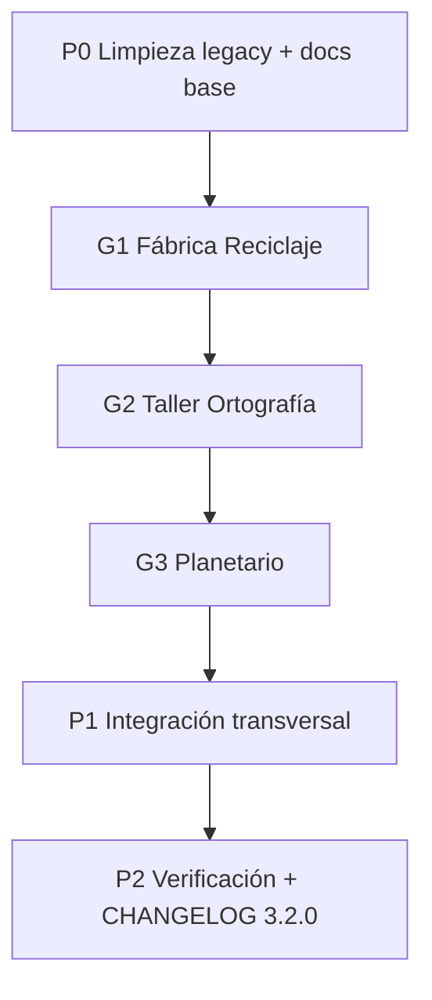

# Fase 7 — Tres minijuegos nuevos (v3.2.0)

Plan de implementación para pasar de **7 a 10 minijuegos**, con documentación alineada, i18n es/ca/en y limpieza de artefactos legacy.

**Versión objetivo:** `3.2.0`  
**Estado:** ✅ Completado (julio 2026)  
**Prerrequisitos:** Fases 0–6 completadas, i18n pedagógico v3.1.1, cobertura stores ≥ 60 %

---

## 1. Objetivos

| # | Objetivo |
|---|----------|
| 1 | Añadir **Fábrica del Reciclaje** (medio ambiente, drag-and-drop) |
| 2 | Añadir **Taller de Ortografía** (lengua, quiz de huecos) |
| 3 | Añadir **Planetario** (ciencias, ordenación temporal) |
| 4 | Integrar los 3 en dashboard, `gameDataRegistry`, tests y script UI |
| 5 | Actualizar toda la documentación viva y eliminar docs/scripts obsoletos |

---

## 2. Mapa de los tres juegos

| Código | Ruta | Materia | Mecánica base | Juego referencia |
|--------|------|---------|---------------|------------------|
| `fabrica-reciclaje` | `/world/fabrica-reciclaje` | Medio ambiente | Drag-and-drop a contenedores | `puerto-palabras` |
| `taller-ortografia` | `/world/taller-ortografia` | Lengua / ortografía | Frase con hueco + opciones | `bosc-lectura` (quiz) |
| `planetario` | `/world/planetario` | Ciencias (Sistema Solar) | Ordenar tarjetas en línea | `museo-tiempo` |

### Métricas objetivo (post-Fase 7)

| Métrica | v3.1.x | v3.2.0 |
|---------|--------|--------|
| Minijuegos | 7 | **10** |
| Archivos JSON pedagógicos (×3 locales) | 21 | **30** |
| Tests Jest (stores) | ~65 | **≥ 85** |
| Cobertura stores | ~63 % | **≥ 60 %** (mantener umbral CI) |
| Entradas en `test-all-games-ui.mjs` | 7 | **10** |

---

## 3. Orden de implementación recomendado



**Secuencia:**

1. **P0 — Preparación** (~1 PR inicial): limpieza legacy, CHANGELOG `[Unreleased]`, ampliar `gameDataRegistry` (claves vacías opcional).
2. **G1 — Fábrica del Reciclaje**: clon controlado de Puerto; valida patrón drag-and-drop + i18n categorías.
3. **G2 — Taller de Ortografía**: clon del flujo quiz de Bosc; sin texto largo, rondas rápidas.
4. **G3 — Planetario**: clon de Museo del Tiempo; reutilizar `DragDropContext` y lógica de timeline.
5. **P1 — Integración**: dashboard, tests UI, `page.test.tsx` (10 juegos), docs finales.
6. **P2 — Cierre**: `CHANGELOG [3.2.0]`, tag, PR.

---

## 4. Especificación por juego

### 4.1 Fábrica del Reciclaje (`fabrica-reciclaje`)

**Narrativa:** Clasificar residuos en los contenedores correctos para completar la cadena de reciclaje.

**Mecánica (igual que Puerto Palabras):**
- Pool de ~10 objetos por ronda (de pool total ≥ 40).
- 4–5 contenedores: `amarillo`, `azul`, `verde`, `marron`, `organico` (valorar `punto_limpio` como 6.º opcional).
- Feedback inmediato con regla pedagógica (`rule`).
- Meta: **8 aciertos consecutivos** o barra de progreso (recomendado: **8/8 clasificados** sin sistema de barco).
- 3 vidas opcionales **o** reintento por ítem (como Puerto: solo feedback, sin vidas).

**Modelo de datos** — `fabrica-reciclaje-items.json`:

```typescript
interface ReciclajeItem {
  id: string;
  item: string;           // "Botella de plástico"
  emoji?: string;         // "🍼" (opcional, UI)
  bin: 'amarillo' | 'azul' | 'verde' | 'marron' | 'organico';
  rule: string;           // "El plástico va al contenedor amarillo"
}
```

**Store:** `useFabricaReciclajeStore.ts`  
**Persistencia:** `fabrica-reciclaje-storage`  
**Badge:** «Eco-Héroe Junior»

**Archivos a crear:**

```
src/app/world/fabrica-reciclaje/
├── page.tsx
├── types.ts
├── dragdrop-utils.ts      # BINS + ReciclajeItem
├── useFabricaReciclajeStore.ts
└── __tests__/useFabricaReciclajeStore.test.ts

src/app/data/locales/{es,ca,en}/fabrica-reciclaje-items.json
```

**i18n (`common.json`):** prefijo `reciclaje.*` — instrucciones, categorías (`reciclaje.bins.amarillo`), playing, completed, failed.

**Contenido mínimo:** 40 ítems ES; traducción CA/EN (nombres de residuos + reglas).

---

### 4.2 Taller de Ortografía (`taller-ortografia`)

**Narrativa:** Completar frases eligiendo la forma ortográfica correcta (B/V, G/J, H, acentos, ll/y, etc.).

**Mecánica (derivada de Bosc, sin lectura larga):**
- 8–10 preguntas por partida (`selectRandom` del pool).
- Cada ítem: frase con `___`, 3–4 opciones, una correcta.
- 5 corazones (como Bosc).
- Sin pantalla de pasaje: pregunta → comprobar → feedback → siguiente.

**Modelo de datos** — `taller-ortografia-items.json`:

```typescript
interface OrtografiaItem {
  id: number;
  sentence: string;       // "El ___ canta en el árbol"
  options: string[];    // ["pájaro", "bajaro", "pajaro"]
  answer: number;         // índice correcto
  rule: string;           // "Pájaro lleva tilde en la á"
  topic?: 'bv' | 'gj' | 'h' | 'tilde' | 'll-y' | 'r-rr';
}
```

**Store:** `useTallerOrtografiaStore.ts`  
**Persistencia:** `taller-ortografia-storage`  
**Badge:** «Maestro de la Ortografía»

**Componente:** `SpellingGame.tsx` (equivalente simplificado a `ReadingGame.tsx`).

**Archivos a crear:**

```
src/app/world/taller-ortografia/
├── page.tsx
├── types.ts
├── SpellingGame.tsx
├── useTallerOrtografiaStore.ts
└── __tests__/useTallerOrtografiaStore.test.ts

src/app/data/locales/{es,ca,en}/taller-ortografia-items.json
```

**Contenido mínimo:** 50 ítems ES balanceados por `topic`; CA/EN adaptados (reglas equivalentes donde aplique).

---

### 4.3 Planetario (`planetario`)

**Narrativa:** Ordenar planetas (o hitos espaciales) de menor a mayor distancia al Sol / en orden cronológico.

**Mecánica (clon de Museo del Tiempo):**
- Ronda de **8** tarjetas (pool ≥ 20).
- Modos (valorar v1 vs v2):
  - **v1 (recomendada):** solo «distancia al Sol» — planetas + Plutón opcional como bonus.
  - **v2 (futura):** subruta `/planetario/[mode]` como Mapamundi (`planetas` | `exploracion`).
- Drag pool → slots; botón «Comprobar orden».
- 3 vidas; XP por ronda correcta.

**Modelo de datos** — `planetario-bodies.json`:

```typescript
interface CelestialBody {
  id: string;
  name: string;
  order: number;          // 1 = Mercurio … 8 = Neptuno
  fact: string;           // "El planeta más cercano al Sol"
  emoji?: string;
}
```

**Store:** `usePlanetarioStore.ts` (copiar `useMuseoTiempoStore`, renombrar campos `event` → `body`, `year` → `order`).  
**Persistencia:** `planetario-storage`  
**Badge:** «Astrónomo Junior»

**Archivos a crear:**

```
src/app/world/planetario/
├── page.tsx
├── types.ts
├── usePlanetarioStore.ts
└── __tests__/usePlanetarioStore.test.ts

src/app/data/locales/{es,ca,en}/planetario-bodies.json
```

**Contenido mínimo:** 8 planetas + 12 hitos de exploración espacial (para variedad en rondas).

---

## 5. Cambios transversales (checklist)

### 5.1 Datos e i18n

- [x] Añadir claves a `GAME_DATA_KEYS` en `gameDataRegistry.ts`:
  - `fabrica-reciclaje-items`
  - `taller-ortografia-items`
  - `planetario-bodies`
- [x] Crear 9 JSON nuevos (`es`, `ca`, `en` × 3).
- [x] Claves UI en `public/locales/{es,ca,en}/common.json` (prefijos `reciclaje`, `ortografia`, `planetario`).
- [x] Entradas dashboard en `games.<codigo>.{name,description,subject}`.

### 5.2 Dashboard e iconos

Actualizar `src/app/page.tsx` — array `minigames`:

| code | icon (lucide) | color sugerido |
|------|---------------|----------------|
| `fabrica-reciclaje` | `Recycle` | green |
| `taller-ortografia` | `SpellCheck` o `PenLine` | indigo |
| `planetario` | `Orbit` o `Moon` | violet |

### 5.3 Hooks compartidos

Cada `page.tsx` debe usar:
- `useGameData('<clave>')`
- `useGameSession` + `useReloadGameDataOnLocale` (patrón Puerto/Mercado/Museo)

**Atención:** stores con `gameStatus: 'playing'` y arrays vacíos deben inicializarse vía `useGameSession` (lección aprendida en Mapamundi v3.1.2).

### 5.4 Tests

| Ámbito | Acción |
|--------|--------|
| Store ×3 | `__tests__/use*Store.test.ts` — init, acierto, fallo, victoria, reset |
| Dashboard | `page.test.tsx` — mock 10 juegos |
| UI humo | `scripts/test-all-games-ui.mjs` — 3 funciones nuevas |
| CI | Mantener umbral 60 % en stores |

### 5.5 Verificación manual

Checklist §14.5 de GAME_ARCHITECTURE — validado en humo UI (jul 2026):

- [x] Instrucciones → jugar → victoria (10 rutas)
- [x] Derrota (si aplica) — Bosc, Mercado, Mapamundi, STEAM, Flip, Museo, Ortografía, Planetario
- [x] Recarga mid-game conserva sesión (patrón `useGameSession` + persist)
- [x] Cambio ES/CA/EN recarga pool (`useReloadGameDataOnLocale`)
- [x] Sin errores de consola en humo Playwright

### Verificación P2 automatizada (jul 2026)

| Comando | Resultado |
|---------|-----------|
| `npm run test:ci` | 85 tests, cobertura **67.4 %** líneas |
| `npm run test:ui` | **10/10** minijuegos OK |
| `npm run lint` + `npm run build` | OK |

---

## 6. Documentación a actualizar

| Documento | Cambios |
|-----------|---------|
| `CHANGELOG.md` | Sección `[3.2.0]` ✅ |
| `docs/GAME_ARCHITECTURE.md` | Tabla 10 juegos; §15 Fase 7 ✅ |
| `docs/CORRECTION_PLAN.md` | § Fase 7 completada ✅ |
| `docs/PHASE7_NEW_GAMES_PLAN.md` | DoD marcado ✅ |
| `README.md` | 10 juegos, scripts test ✅ |
| `CLAUDE.md` | 10 minijuegos, rutas nuevas ✅ |
| `STEAM_GAME_DOCS.md` | Sin cambios (alcance acotado a STEAM) |

---

## 7. Limpieza de documentos y scripts legacy

### 7.1 Borrar (obsoletos o redundantes)

| Ruta | Motivo |
|------|--------|
| `/workspace/ANALISIS_REVISION.md` | Auditoría **abril 2026** desactualizada (6 juegos, 30+ errores TS, estado pre-Fase 0). Sustituida por `CORRECTION_PLAN` + `GAME_ARCHITECTURE`. |
| `scripts/debug-mapamundi.mjs` | Depuración puntual; cubierto por `test-all-games-ui.mjs`. |
| `scripts/debug-continent-click.mjs` | Idem. |
| `scripts/test-mapamundi-ui.mjs` | Redundante con `test-all-games-ui.mjs`. |

### 7.2 Reemplazar / unificar

| Ruta | Acción |
|------|--------|
| `/workspace/README.md` | Sustituir por puntero breve al subproyecto activo (`aventura-multimateria/`). |
| `/workspace/CLAUDE.md` | Sustituir por puntero a `aventura-multimateria/CLAUDE.md` (fuente única). |

### 7.3 Mantener

| Ruta | Motivo |
|------|--------|
| `docs/CORRECTION_PLAN.md` | Histórico fases 0–6 + índice Fase 7 |
| `docs/GAME_ARCHITECTURE.md` | Contrato arquitectónico vivo |
| `STEAM_GAME_DOCS.md` | Referencia Blockly |
| `scripts/test-all-games-ui.mjs` | Humo UI de los 10 juegos |
| `scripts/generate-locale-translations.mjs` | Generación asistida de traducciones JSON |
| `scripts/flip-lesson-translations.mjs` | Idem Flip |

---

## 8. Definition of Done (Fase 7)

- [x] 3 rutas `/world/*` operativas con flujo completo
- [x] 9 JSON pedagógicos (es/ca/en) validados contra `types.ts`
- [x] Dashboard muestra **10** minijuegos
- [x] `gameDataRegistry` incluye 3 claves nuevas
- [x] ≥ 85 tests Jest pasando; cobertura stores ≥ 60 % (67.4 % líneas, jul 2026)
- [x] `node scripts/test-all-games-ui.mjs` — 10/10 OK
- [x] `npm run lint` + `npm run build` OK
- [x] Documentación §6 actualizada; legacy §7.1 eliminado
- [x] `CHANGELOG.md` publicado como `[3.2.0]`

---

## 9. Riesgos y mitigaciones

| Riesgo | Mitigación |
|--------|------------|
| Duplicación de código (3 clones) | Extraer helpers solo si el tercer clon confirma patrón; priorizar ship sobre abstracción prematura |
| Contenido CA/EN laborioso | Generar ES primero; script `generate-locale-translations.mjs`; revisión manual de reglas ortográficas |
| Drag-and-drop en móvil | Misma limitación que Puerto/Museo; documentar; tests desktop-first |
| Planetario: debate Plutón | Documentar en JSON; usar 8 planetas oficiales IAU en v1 |
| Grid dashboard 10 tarjetas | Layout `lg:grid-cols-3` ya soporta; verificar en móvil |

---

## 10. Trazabilidad

| Documento | Rol |
|-----------|-----|
| [GAME_ARCHITECTURE.md](./GAME_ARCHITECTURE.md) | Contrato técnico §14 checklist |
| [CORRECTION_PLAN.md](./CORRECTION_PLAN.md) | Índice de fases del proyecto |
| [CHANGELOG.md](../CHANGELOG.md) | Registro de versiones |
| [PHASE7_NEW_GAMES_PLAN.md](./PHASE7_NEW_GAMES_PLAN.md) | **Este plan** — detalle de implementación v3.2.0 |

---

*Última actualización: julio 2026 — ExplorAventura 3, Fase 7 completada (v3.2.0).*
